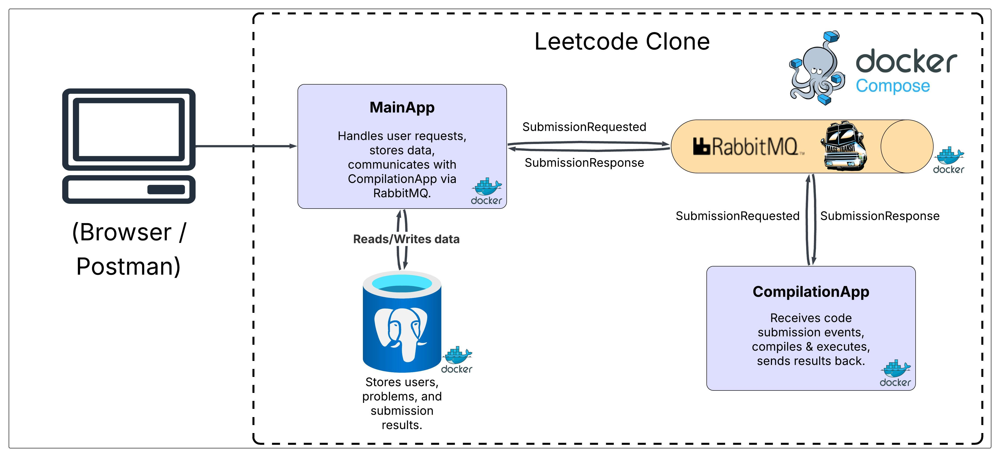

# LeetCode Clone with .NET 8.0

> **Development Status**: This project is in active development and is not production-ready. Breaking changes are expected until the first stable release.


This is a LeetCode inspired coding challenge platform built with .NET 8.0.  
It allows users to solve coding problems and have their code executed securely inside Docker containers.

## Features

### User Management
- **Authentication**: ASP.NET Core Identity with JWT token-based authentication
- **Profile Management**: User registration, login, and profile customization

### Data Layer
- **Database**: PostgreSQL for reliable data persistence
- **Configuration**: Flexible database connection setup

### Code Execution
- **Secure Sandbox**: Docker-based isolation for safe code compilation and execution
- **Multi-Language Support**: Python and C/C++ challenges
- **Security**: Prevents malicious code from affecting the host system


## Technology Stack

- **Backend**: .NET 8.0, ASP.NET Core
- **Authentication**: ASP.NET Core Identity, JWT
- **Database**: PostgreSQL
- **Message Broker**: RabbitMQ
- **Containerization**: Docker & Docker Compose
- **Supported Languages**: Python, C/C++


## Architecture


## Getting Started

### Prerequisites

Before you begin, ensure you have the following installed

- [Docker](https://www.docker.com/get-started) and [Docker Compose](https://docs.docker.com/compose/install/)
- [.NET 8 SDK](https://dotnet.microsoft.com/download/dotnet/8.0) *(optional - only needed for local development outside Docker)*

### Setup Instructions

**Clone the repository**
```bash
  git clone https://github.com/KakhaberiKarenashvili/LeetCode-Clone-with-.NET-8.0.git
  cd LeetCode-Clone-with-.NET-8.0
```

**Start the application**
```bash
  docker-compose up --build
```

**Access the application**
- Open your browser and navigate to `http://localhost:5001`

### Configuration (Optional)

The application uses PostgreSQL and RabbitMQ services that are automatically configured via Docker Compose. If you prefer to use external services, update the configuration in `appsettings.json`:

**Database Configuration:**
```json
{
  "ConnectionStrings": {
    "DBConnection": "Host=your-host;Port=5432;Database=your-database;Username=your-username;Password=your-password;"
  }
}
```
**Message Broker Configuration:**
```json
{
  "MessageBroker": {
    "Host": "amqp://your-rabbitmq-host:5672",
    "UserName": "your-username",
    "Password": "your-password"
  }
}
```

## Why Docker?

This platform must run inside Docker because the code execution service runs in a Linux-based container with:
- **Security**: Isolated execution environment prevents malicious code from affecting the host system
- **Consistency**: Ensures consistent runtime environment across different development machines
- **Language Support**: Pre-configured Linux container with Python and GCC compilers

## Development Notes
- The project must run inside Docker containers for security reasons
- Code execution happens in isolated Linux containers with pre-installed compilers
- Frequent changes are expected during the development phase
- Database migrations are handled automatically on startup


